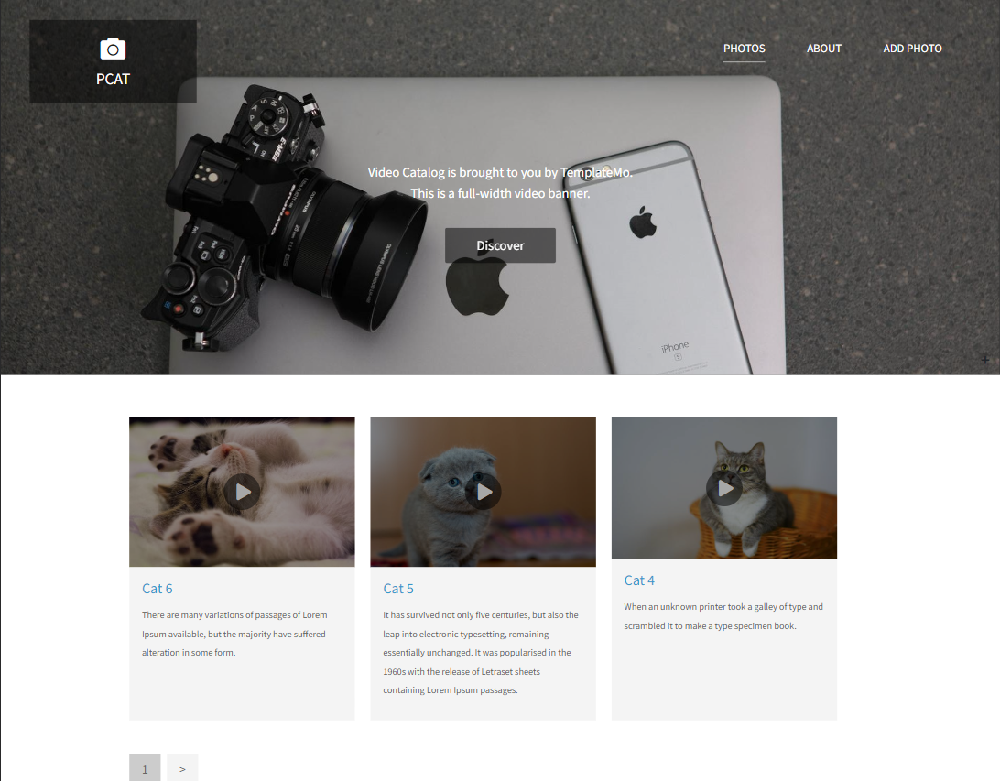
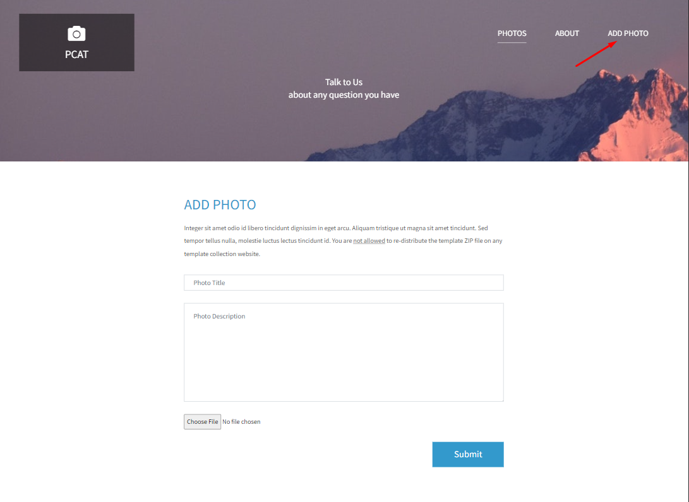
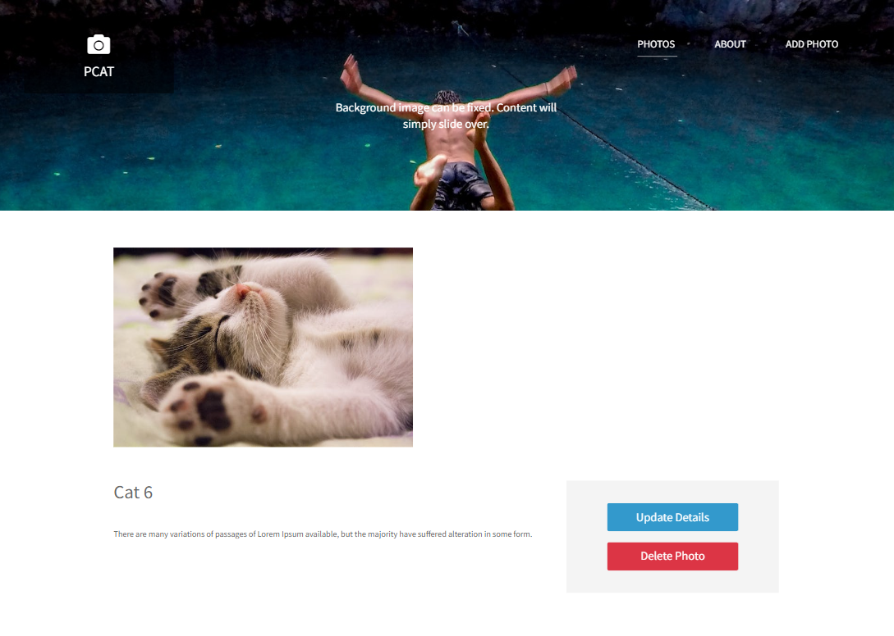

# PCAT-APP

**LIVE DEMO:** [PCAT-APP](https://pcat-app-pg5m.onrender.com/)

PCAT is a web application developed with nodejs. You can add your pictures with a title and a description. You can also display, edit and delete the picture you have already added.

---

## Installation

In the project directory, you should run the commands below:

#### `npm install`

#### `npm start`

Also make sure to connect your own database before you start the app. DB connection is located in the app.js folder.

---

# Project Preview

#### Index Page

You can display the photos you have added here. Three photos are displayed on each page. Each photo is clickable and when you click on one of them, it is going to lead you to its edit page.

#### Add Photo Page

You can add a new photo on this page.

#### Edit Page

You can edit or delete the photo you added by clicking on the relevant photo.

---

## Used technologies

- HTML
- CSS
- JAVASCRIPT
- NODEJS
- MONGODB
- MONGOOSE
- EXPRESSJS
- NODEMON
- MIDDLEWARES
- TEMPLATE ENGINE
- FILESYSTEM
- PAGINATION
- DEPLOYMENT (RENDER)
- MVC

---
